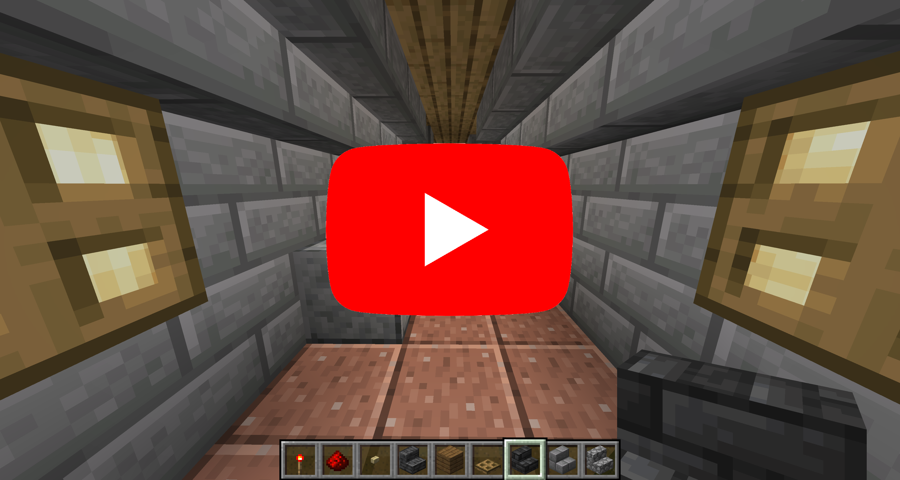

# Bidirectional Flying Machine Subway Station
A bidirectional subway station design for Minecraft flying machines. This is best used for travelling very long distances while AFK.

Pros:
- Doesn't require any connections (rails, ice roads, etc.) between the stations
- AFK-able
- Compact
- Cheap

Cons:
- Slower than Elytra or boat roads
- No way to call flying machine back if you travel to a different station on foot
- Vulnerable to phantoms
